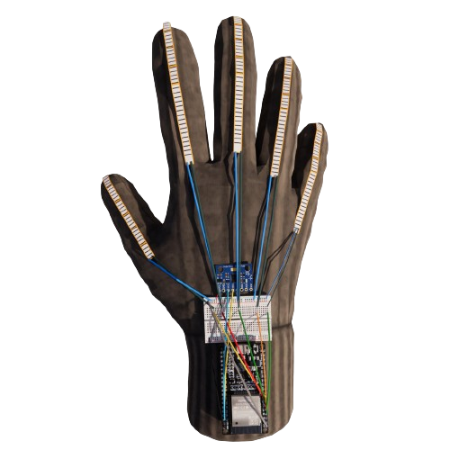

# SignWave | FYP2

> This project introduces a wearable glove to address communication challenges for the deaf community by translating sign language into text. The glove, equipped with flex sensors and a gyroscope, ensures precise detection of sign language gestures. Through a concise data collection phase with participants performing ten gestures, a robust K-Nearest Neighbors (KNN) machine learning model was developed. The technology is deployed using the Django web framework, creating a user-friendly web system for real-time translation. The model demonstrates an impressive 92% accuracy, validated through extensive testing, highlighting its effectiveness in real-world scenarios. This achievement signifies significant progress towards enhancing inclusivity.

##  Architecture

1. **Design IoT Wearable glove**
   Components:
   - 5 Flex sensors -> to measure the bending of the fingers
   - MPU6050 Gyroscope -> to meature the rotations and motions of the hand
   - ESP32 microcontroller -> get the inputs from sensor and transmit it to the cloud
   - wires and ristors -> connect the components
     

3. **Arduion IDE**
   
   -> Data collected using 'CoolTerm' software which is converting the serial output into CSV in order to be proceed to python for some cleaning and processing
   
   -> Realtime Database  >> using *Firebase* for get the real time database and be used for the API to fetch real time readings using JSON format
   
5. **Model Building**
   - data is being clean are preproceesed using *Numby*, *Pandas* framewroks
   - Building the model using *KNN* with 92% accuracy

6. **Django API:**
   - Something
   - Something 
   
7. **Validation**:The machine learning model processes the glove data and generates prediction results using KNN the resluts are recorded and new data is collected again for some model enhancement.
